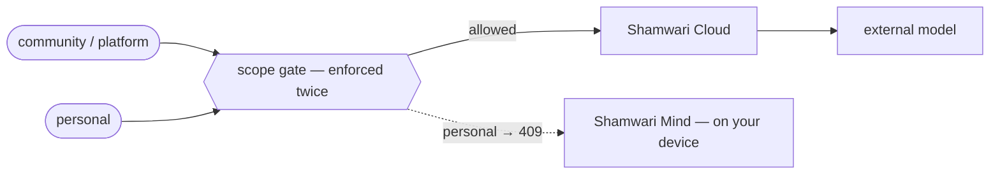

| Scope | What it holds | May reach the cloud |
| --- | --- | --- |
| `personal` | Your own pod — messages, spending, documents, health | ❌ **No. Ever.** |
| `community` | Anonymised patterns across the platform | ✅ Yes |
| `platform` | Base knowledge — law, tax, policy, prices | ✅ Yes |

<Note>
There is no line from `personal` to the cloud. That absence is the product.
Until Shamwari Mind is deployed on a surface, a personal-scope request there
is refused rather than served from public knowledge.
</Note>

## Who decides the scope

Callers declare it, and `platform` is the default — so an unmarked request is
treated as being about public knowledge rather than about you. Getting the
default the other way round would mean a caller who forgot to set a field had
their data classified as shareable.

## Why Mind is load-bearing

Rule 1 has a consequence that is easy to miss: if personal data cannot go to
the cloud, and personal data is what makes a companion a companion, then the
on-device model is the product and the cloud is the general-knowledge
fallback. Shamwari Mind is not a roadmap item that would be nice to have. It
is the half of the system that makes the other half worth using.

Today Mind is not deployed, which is why personal-scope requests are refused
rather than answered. That refusal is the honest state of an unfinished
system, not a design we intend to keep.
